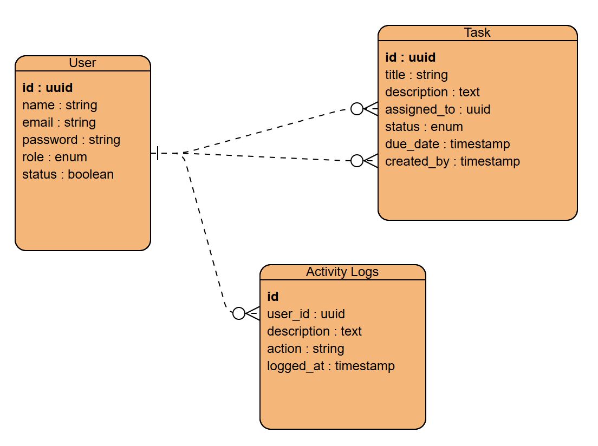

# Fullstack Developer Evaluation - User & Task Management App

Aplikasi ini merupakan hasil evaluasi kemampuan fullstack developer yang dibangun dengan Laravel (backend) dan Vanilla JavaScript + Bootstrap (frontend). Aplikasi ini memiliki fitur manajemen pengguna, penugasan task berdasarkan role, serta logging aktivitas.

---

## 🛠️ Teknologi yang Digunakan

- **Backend:** Laravel 10, Sanctum (API Authentication), MySQL
- **Frontend:** HTML, CSS (Bootstrap), JavaScript (Vanilla)
- **Tool:** Laragon (Local Dev), HeidiSQL, Postman (Testing)

---

## 📐 ERD (Entity Relationship Diagram)

  

---

## 🔑 Role dan Akses

| Role   | Akses                                                                 |
|--------|-----------------------------------------------------------------------|
| Admin  | CRUD user, melihat semua task, melihat log aktivitas                 |
| Manager| Membuat task untuk staff, melihat task yang dibuat/diberikan         |
| Staff  | Melihat task yang ditugaskan ke dirinya                              |

---

## 📦 Instalasi

1. **Clone repo ini**
```bash
git clone https://github.com/ridwanam9/UserAndTask.git
cd UserAndTask
```
2. **Install Dependensi**
```bash
composer install
npm install
```
3. **Buat file .env**
```bash
cp .env.example .env
```
4. **Atur koneksi database di env**
```bash
DB_DATABASE=tes_fullstack
DB_USERNAME=root
DB_PASSWORD=
```
5. **Generate key**
```bash
php artisan key:generate
```
6. **Jalankan migrasi dan seeder**
```bash
php artisan migrate --seed
```
7. **Jelankan Server**
```bash
php artisan serve
```

## 🧪 Testing
```bash
php artisan test
```
Untuk coverage:
```bash
php artisan test --coverage
```


## 📋 API Endpoints (Autentikasi + Task)
### Login
POST /api/login

### Protected (require token Sanctum)
GET /api/tasks

POST /api/tasks

PUT /api/tasks/{id}

DELETE /api/tasks/{id}

GET /api/users

POST /api/users

GET /api/logs

## 🌐 Frontend
Semua halaman frontend berada di folder public/frontend/:

- index.html → Login page

- dashboard.html → Dashboard user (manager/staff)

- admin.html → Admin panel

## 👤 Login Awal (Seeder)
| Email                                         | Password | Role  |
| --------------------------------------------- | -------- | ----- |
| [admin@email.com](mailto:admin@email.com) | password | Admin |


## 📎 Catatan
- Token login disimpan di localStorage

- Manager hanya bisa assign task ke staff

- Hanya admin yang bisa melihat log aktivitas

- Setiap request API dicatat otomatis oleh middleware LogRequest

## ✅ Fitur Tambahan
- Validasi berdasarkan role dan status aktif user

- Tugas yang lewat due date bisa dideteksi dengan command scheduler (cek tiap jam)

- Role-based navbar + halaman

## 🙏 Terima Kasih
Silakan kontak saya jika ada pertanyaan. Terima kasih atas kesempatan ini 🙌
